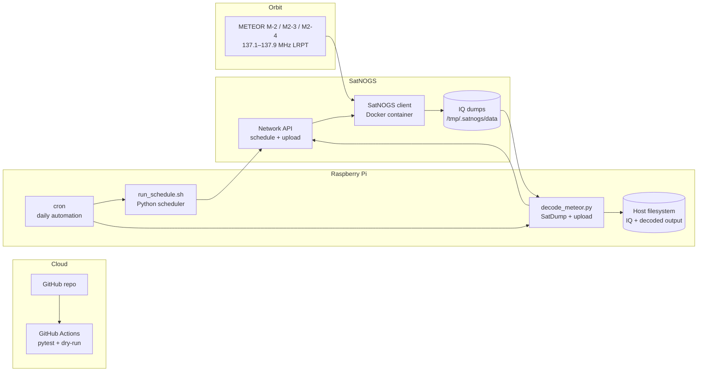
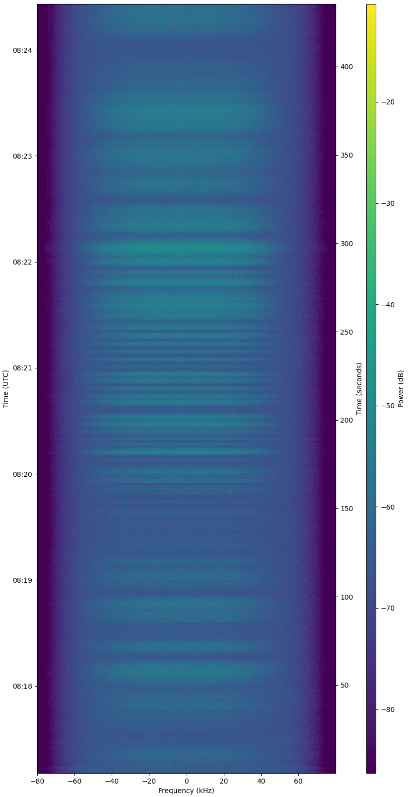

# SatNOGS Pipeline

Automated ground station pipeline for scheduling, receiving, and decoding METEOR weather satellite images on a Raspberry Pi SatNOGS station ([Wroclaw Ground Station #4924](https://network.satnogs.org/stations/4924/)).

## What This Project Does

- Plans METEOR observations (M-2, M2-3, M2-4) for the next 24 hours through the SatNOGS Network API.
- Avoids duplicate scheduling by checking already planned future observations.
- Collects IQ dumps from the SatNOGS client container and decodes them with SatDump.
- Uploads decoded color images to the SatNOGS observation **Data** tab.
- Runs daily via cron on the Raspberry Pi (scheduler + decode/upload batch from the previous UTC day).
- Validates scheduling logic in GitHub Actions with pytest.

## Architecture



| Component | Role |
|---|---|
| **GitHub Actions** | CI: pytest, scheduler dry-run |
| **Raspberry Pi cron** | Daily entry point (schedule, decode, cleanup) |
| **`run_schedule.sh`** | Fetches TLE, predicts passes (Skyfield), schedules observations |
| **SatNOGS client (Docker)** | Executes RF observations, stores IQ dumps |
| **`decode_meteor.py`** | Copies IQ to host, decodes with SatDump, uploads PNG |
| **Local output archive** | Decoded products + `decode.ok` / `upload.ok` markers |

## Example Results

**Observation [#14498311](https://network.satnogs.org/observations/14498311/)** — METEOR M2-3, 2026-07-12 08:17 UTC, max elevation 60°, status **Good**.

Waterfall (RF capture in SatNOGS client):



Decoded false-color image (SatDump `meteor_m2-x_lrpt`, uploaded to SatNOGS Data tab):


## Repository Structure

- `config/targets.yaml` — station metadata and METEOR targets (M-2, M2-3, M2-4).
- `src/satnogs_pipeline/` — scheduler and API client logic.
- `scripts/run_schedule.sh` — wrapper for scheduler runs.
- `scripts/decode_meteor.py` — daily/batch decode and upload utility.
- `scripts/update_repo.sh` — safe `git pull --ff-only` before cron jobs.
- `scripts/post_observation.sh` — post-observation logging hook (container side).
- `docs/images/` — example waterfall and decoded output for README.
- `.github/workflows/ci.yml` — tests in CI.

## Prerequisites

- Raspberry Pi with SatNOGS client running in Docker.
- Python virtual environment in this repository (`.venv`).
- SatDump installed on the host (`meteor_m2-x_lrpt` pipeline).
- `SATNOGS_API_TOKEN` in `.env` for live scheduling and upload.

## Setup

```bash
cd /home/palac/satnogs-pipeline
cp .env.example .env
# edit .env and set SATNOGS_API_TOKEN

python3 -m venv .venv
.venv/bin/pip install -r requirements.txt
```

## Scheduler Usage

Dry-run:

```bash
./scripts/run_schedule.sh --dry-run
```

Live run:

```bash
./scripts/run_schedule.sh
```

## Decode Usage

Decode all IQ dumps from the previous UTC day and upload to SatNOGS:

```bash
set -a && source .env && set +a
.venv/bin/python scripts/decode_meteor.py --upload-data
```

Decode a specific UTC day:

```bash
.venv/bin/python scripts/decode_meteor.py --upload-data --date 2026-07-12
```

Decode a single specific IQ file:

```bash
.venv/bin/python scripts/decode_meteor.py --upload-data --iq-file iq_cs16_2026-07-12T08-17-09.raw
```

Preview planned work without decoding:

```bash
.venv/bin/python scripts/decode_meteor.py --date 2026-07-12 --dry-run
```

Force re-decode even if marker exists:

```bash
.venv/bin/python scripts/decode_meteor.py --upload-data --date 2026-07-12 --force
```

## Daily Cron Automation

Example crontab entries:

```cron
SHELL=/bin/bash
PATH=/usr/local/sbin:/usr/local/bin:/usr/sbin:/usr/bin:/sbin:/bin

# Plan METEOR observations for next 24h
10 0 * * * cd "/home/palac/satnogs-pipeline" && mkdir -p logs && (./scripts/update_repo.sh >> logs/cron_update.log 2>&1 || true) && ./scripts/run_schedule.sh >> logs/cron_schedule.log 2>&1

# Decode + upload IQ dumps from previous UTC day
40 0 * * * cd "/home/palac/satnogs-pipeline" && mkdir -p logs && (./scripts/update_repo.sh >> logs/cron_update.log 2>&1 || true) && set -a && source ./.env && set +a && ./.venv/bin/python scripts/decode_meteor.py --upload-data --date "$(date -u -d 'yesterday' +\%F)" >> logs/cron_decode.log 2>&1

# Cleanup old IQ files in SatNOGS client container
55 0 * * * cd "/home/palac/satnogs-pipeline" && mkdir -p logs && sudo docker exec satnogs_satnogs-client sh -lc 'find /tmp/.satnogs/data -type f -mtime +1 -delete; df -h /tmp' >> logs/cron_cleanup.log 2>&1
```

## Data Paths

- **Container IQ input**: `/tmp/.satnogs/data/iq_cs16_*.raw`
- **Host copied IQ**: `/home/palac/satnogs-decode/raw/`
- **Decoded output**: `/home/palac/satnogs-decode/output/<satellite>/<YYYY-MM-DD>/<timestamp>/`
- **Markers**: `decode.ok` and `upload.ok` inside each output directory

## Logs

- Scheduler cron log: `logs/cron_schedule.log`
- Decode cron log: `logs/cron_decode.log`
- Repo update log: `logs/cron_update.log`
- Container cleanup log: `logs/cron_cleanup.log`
- Hook log (container): `/opt/satnogs-non-free/hooks/logs/post_observation.log`

## Validation

Run tests locally:

```bash
PYTHONPATH=src .venv/bin/pytest -q
```

## Notes

- Decode uses SatDump `meteor_m2-x_lrpt` with `--samplerate=160000` and `--baseband_format=cs16` (SatNOGS IQ dumps are decimated to ~160 kS/s).
- Daily decode/upload is idempotent thanks to `decode.ok` and `upload.ok` marker files.
- UTC date is used for batch selection to avoid timezone boundary issues.
